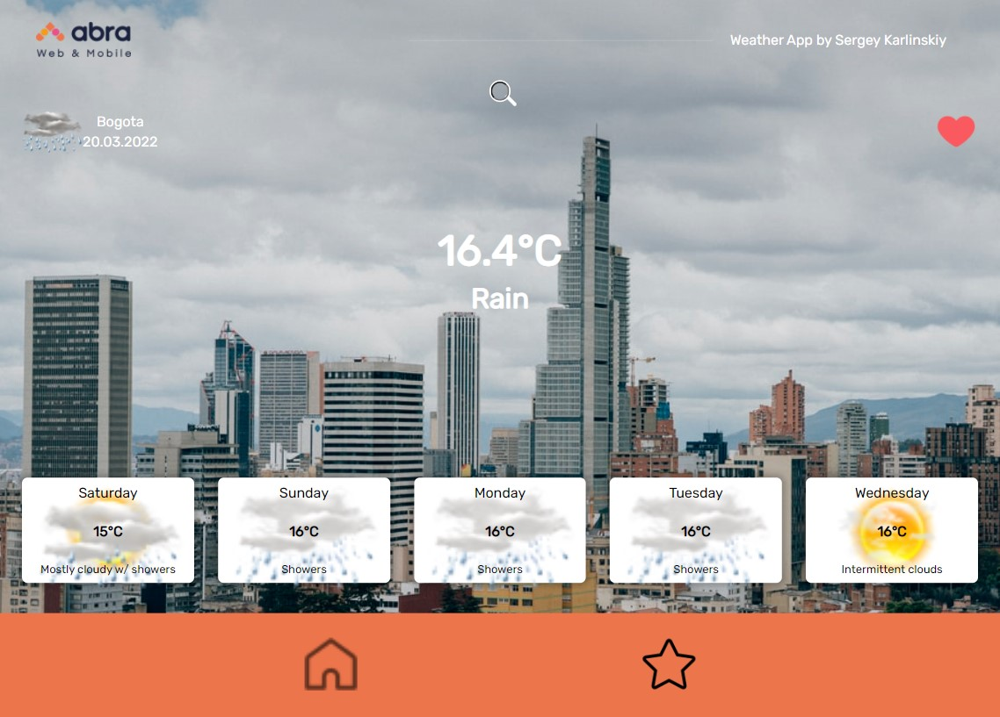

## **Weather App for @herolo-test-task**

SPA Weather App with search autocomplete, 5-day weather forecast and geolocations on board.
Used <a href="https://developer.accuweather.com/" target="_blank">**AccuWeather API**</a>

🚀 The demo<a href="https://weather-app-herolo.web.app" target="_blank">**is here**</a><br />

### Local Deploy

```
$ git clone https://github.com/ieffai/herolo-test-task.git
$ npm install
$ get your own Google API key to fetch city photos on requests
$ create google custom search engine to get privite search ID
$ npm run start
```

- **Used technologies**

  - React, JS
  - Sass, CSS Modules
  - Redux, Redux Toolkit, react router
  - axios

## 

**For suggestions and errors:**
4923920@gmail.com
